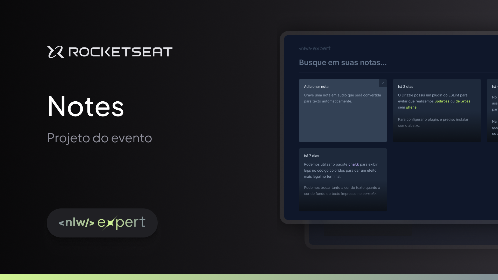

<p align="center">
  
</p>

<!-- <p align="center">
  <a href="#-tecnologias">Tecnologias</a>&nbsp;&nbsp;&nbsp;|&nbsp;&nbsp;&nbsp;
  <a href="#-layout">Layout</a>&nbsp;&nbsp;&nbsp;|&nbsp;&nbsp;&nbsp;
  <a href="#memo-licença">Licença</a>
</p> -->

# NLW Expert - Notes

Bem-vindo(a) ao Expert Notes, um projeto de notas estilo post-its. Nesse projeto é possível gerar o texto das notas através da gravação de áudio, utilizando uma API do navegador. 

Esse projeto faz parte da NLW Expert trilha React, promovido pela RocketSeat em Fevereiro de 2024.


## 🚀 Principais Funcionalidades

- Armazenamento de notas post-its;
- Integração com a API SpeechRecognition para a transcrição de notas de áudio;

## 🎨 Layout

https://www.figma.com/file/n9upvF4p71Qq4Wz8avt4Za/NLW-expert-%E2%80%A2-Notes-(Community)?type=design&node-id=2104%3A673&mode=design&t=5j6I7zwlaGUTeg24-1


## ⚠️ Requisitos para a instalação
```
## Para ver a versão do node:
node -v
```

```
## Para ver a versão do yarn:
yarn -v
```

É necessário que você tenha em sua máquina uma versão do **node >= 18** e a do **yarn >= 1**. Caso não possua algum desses dois requisitos, você poderá seguir o passo a passo para a instalação nos links abaixo:

[Como instalar o node em qualquer sistema operacional](https://efficient-sloth-d85.notion.site/Instalando-o-Node-js-d40fdabe8f0a491eb33b85da93d90a2f)

[Como instalar o yarn em qualquer sistema operacional](https://efficient-sloth-d85.notion.site/Instalando-o-Yarn-eca6a13be5b3467d8d2f7be15c60f322)

É necessário fazer a instalação de alguns plugins para o VSCode, com o intuito de facilitar na hora do desenvolvimento:

[ESLint](https://marketplace.visualstudio.com/items?itemName=dbaeumer.vscode-eslint)

[PostCSS Language Support](https://marketplace.visualstudio.com/items?itemName=csstools.postcss)

[Tailwind CSS IntelliSense](https://marketplace.visualstudio.com/items?itemName=bradlc.vscode-tailwindcss)

## 👣 Passo a passo para rodar o projeto em sua máquina

1 - Para clonar o projeto:
```
git clone git@github.com:joaoD3V/nlw-expert-notes.git
```

### Para rodar o projeto web

1 - Para instalar as dependências do projeto:
```
yarn install
```
2 - Para rodar o projeto:
```
yarn dev
```

### Para rodar o projeto server
1 - Para instalar as dependências do projeto:
```
yarn install
```
2 - Para rodar o projeto:
```
yarn dev
```


## :memo: Licença

Este projeto está licenciado sob a [MIT License](https://opensource.org/licenses/MIT).

---

Feito com ♥ by joaoD3V